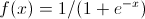
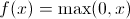
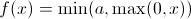
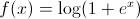
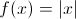
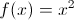
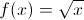
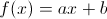

# Neuron types

The types of neurons (hidden unit nonlinearities) supported by the net.

Most of the [layer types](LayerParams.md) take a `neuron=x` parameter, which
defines the output nonlinearity of neurons in the layer.

These are the supported neuron types:

| Parameter | Name | Function |
|-----------|------|----------|
| `neuron=logistic` | logistic |  |
|`neuron=tanh[a,b]` | hyperbolic tangent |  |
| `neuron=relu` | rectified linear |  |
| `neuron=brelu[a]` | bounded rectified linear |  |
| `neuron=softrelu` | soft rectified linear |  |
| `neuron=abs` | absolute value |  |
| `neuron=square` | square |  |
| `neuron=sqrt` | square root |  |
| `neuron=linear[a,b]` | linear |  |

_x_, _a_, and _b_ above are all scalars.

Adding new types of neurons is easy. See [`neuron.cuh`](../include/neuron.cuh)
for reference.
