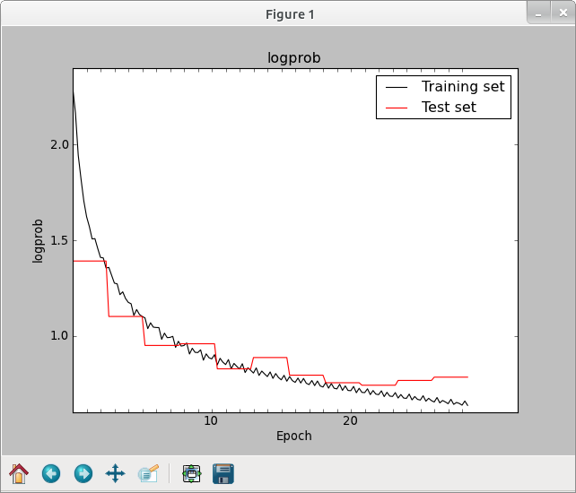
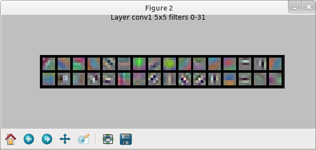
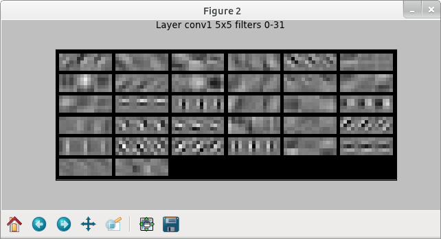
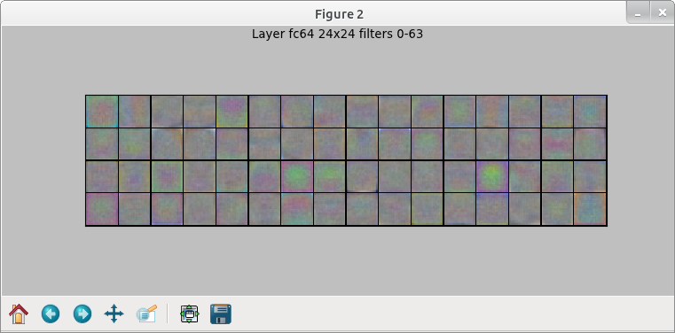
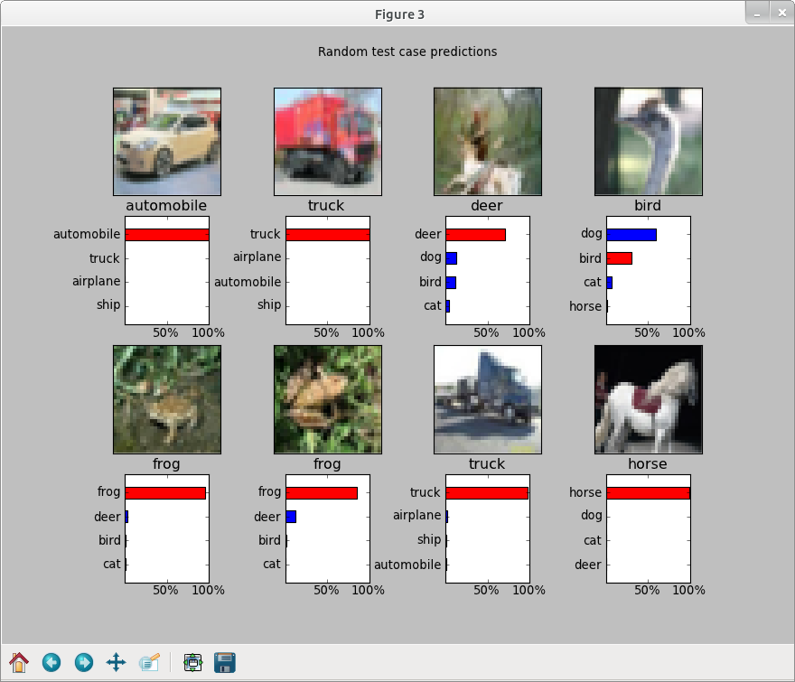

# How to look inside the checkpoints saved by the net

## Introduction

Included with this code is a basic script called [`shownet.py`](../shownet.py).
It has three functions:

* to plot the training/test error over time,
* to display the filters that the neural net learned, and
* to show the predictions (and errors) made by the net.

This script requires the [matplotlib](https://matplotlib.sourceforge.net/) python
library (package name `python-matplotlib` in Ubuntu and Fedora).

## Details

### Plotting the cost function

To plot the evolution of the value of some cost function over time, call the script like this:

```sh
python shownet.py \
    -f /storage2/tmp/ConvNet__2011-08-24_16.49.31 \
    --show-cost=logprob
```

This will cause the script to open the latest checkpoint at
`/storage2/tmp/ConvNet__2011-08-24_16.49.31` and to plot the cost function named
`logprob` (which is the name that we happened to give to the cost layer -- see
[LayerParams#Logistic_regression_cost_layer]).

You should see output that looks something like this:



which plots the training and test error over time.

If your objective returns multiple values (for example the `cost.logreg` objective returns the logprob as well as the classification error), you can plot a particular value like this:

```sh
python shownet.py \
    -f /storage2/tmp/ConvNet__2011-08-24_16.49.31 \
    --show-cost=logprob \
    --cost-idx=1
```

This will plot the classification error rather than the log probability of the data.

### Viewing learned filters
To view the filters that the net learned, call the script like this:

```sh
python shownet.py \
    -f /storage2/tmp/ConvNet__2011-08-24_16.49.31 \
    --show-filters=conv32
```

This will cause the script to draw the filters in the layer named `conv32`. You should see output that looks something like this:



Note that you're not likely to get such pretty filters in higher layers. So this visualization is mostly useful only for looking at data-connected layers.

You'll notice that the script has interpreted the 3 channels in the `conv32` layer as RGB color channels. It will only do this for layers that have 3 channels. If the RGB assumption is incorrect (i.e. your 3 channels correspond to something other than RGB colors), you can use the `--no-rgb=1` option to instruct the script not to combine the channels. It will then plot the channels separately.

An example:

```sh
python shownet.py \
    -f /storage2/tmp/ConvNet__2011-08-24_16.49.31 \
    --show-filters=conv32 \
    --no-rgb=1
```

will produce output that looks like this:



Here the 3 channels of each filter are plotted side-by-side in grayscale.

By default, the script shows you the first weight matrix in the layer you've specified. If your layer takes multiple inputs and you'd like to select a particular weight matrix, you can do so with the `--input-idx` parameter:

```sh
python shownet.py \
    -f /storage2/tmp/ConvNet__2011-08-24_16.49.31 \
    --show-filters=conv32 \
    --input-idx=0
```

#### Viewing learned filters in fully-connected layers

There is one extra meta-parameter that the `--show-filters` parameter takes,
which is only useful for viewing filters in fully-connected layers.

Running the script like this:

```sh
python shownet.py \
    -f /storage2/tmp/ConvNet__2011-08-24_17.56.48 \
    --show-filters=fc64 \
    --channels=3
```

produces output that looks like this:



Here the layer name `fc64` given to the `--show-filters` option refers to a
fully-connected layer. The extra parameter is `--channels=3`, which specifies
the number of channels that the filters in this layer have have. This has to be
given because a fully-connected layer looks upon its input as completely flat.
It is not aware of channels or image dimensions, etc.

### Viewing test case predictions

To see the predictions that the net makes on test data, run the script like this:

```sh
python shownet.py \
    -f /storage2/tmp/ConvNet__2011-08-24_17.56.48 \
    --show-preds=probs
```

`--show-preds=probs` tells the script the name of the softmax layer whose predictions we wish to view.

You should see output that looks like this:



This shows 8 random images from the test set, their true labels, and the 4
labels considered most probable by the model. The true label's probability is
shown in red, if it is among the top 4. You can see that in this case the model
only got one of the images wrong.

To show _only_ the mis-classified images, run the script like this:

```sh
python shownet.py \
    -f /storage2/tmp/ConvNet__2011-08-24_17.56.48 \
    --show-preds=1 \
    --logreg-name=logprob \
    --only-errors=1
```

Now the script will only show images for which the true label is different from
the model's most-probable label.
